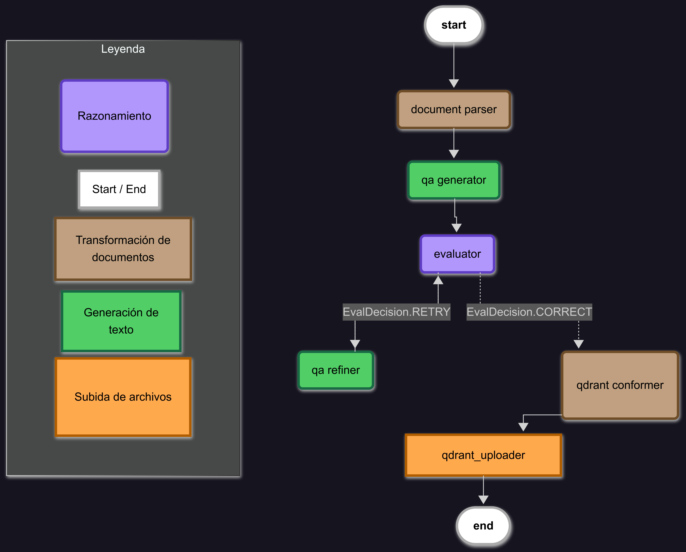

# Ingesta Documental BC

## Ingesta Documental BC

Este proyecto implementa un micro-servicio de API desarrollada con FastAPI. Permite la carga de documentos Word (`.docx`), su procesamiento a través de un grafo potenciado por LLM para generar pares de preguntas y respuestas (Q\&A), y su posterior almacenamiento en una base de vectores mediante Qdrant. Está diseñado para facilitar la ingesta y estructuración semántica de contenidos desde documentos sin estructurar. El resto del código sigue los estándares de estilo y comentarios en inglés.

### Índice

##### - [Tecnologías empleadas](#tecnologías-empleadas)

##### - [Contenidos](#contenidos)

##### - [Lógica del la aplicación](#lógica-de-la-aplicación)

##### - [Modo de uso](#modo-de-uso)

##### - [Hecho](#hecho)

##### - [Por hacer](#por-hacer)

### Tecnologías empleadas

* `uv`: Gestor de ambientes virtuales moderno y ultrarrápido, ideal para gestionar dependencias en entornos reproducibles. Escrito en Rush
* `langchain y langgraph`: Frameworks de trabajo para el desarrollo de aplicaciones potenciadas por LLM.
* `FastAPI`: Framework web asíncrono de alto rendimiento para construir APIs robustas y rápidas.
* `unestructured`: Librería para analizar y extraer contenido de archivos `.docx`.
* `OpenAI`: Cliente oficial para interactuar con modelos de lenguaje GPT de OpenAI.
* `Qdrant`: Base de datos de vectores utilizada para almacenar representaciones semánticas de los contenidos extraídos.
* `specialist`: Analizador del bytecode para mejorar el código en situaciones de necesaria optimización.
* `pytest`: Framework de testing para garantizar la estabilidad del sistema mediante pruebas automatizadas.

### Contenidos

* **main.py:** Archivo principal que ejecuta la API de FastAPI mediante la implementación de una interfaz para cambios y pruebas con otros frameworks.
* **src:** Directorio de ejecución del programa. Está dividido del siguiente modo:
  *  **src/abstractions:** Este directorio contiene las interfaces para el framework de Fastapi, el cliente asíncrono de Qdrant, así como los protocolos que deben seguir los endpoints de las API. Esto nos permite mezclar de forma eficiente inheritance y duck typing, manteniendo una estructura coherente.
  *  **src/application:** La lógica de negocio de la aplicación. Estructurado para seguir un estilo de programación funcional, el directorio contiene la instanciación de los motores de IA, la función de construcción del flujo del grafo, los nodos del grafo, el orquestador de la applicación y las instancias de construcción de los nodos.
  *  **src/client:** El directorio contiene la implementación del cliente asíncrono de Qdrant, basado en `aiohttp` y heredando de la interfaz de cliente asíncrono creada en src/abstractions.
  *  **src/controllers:** Este directorio contiene las funciones de los endpoints de la api, la implementación del framework específico de FastApi y los specs que deben seguir los endpoints para ser cargados en el framework. Los specs pasan un checkeo para comprobar que están conformes al protocolo establecido en src/abstractions.
  *  **src/models:** El directorio contiene todos los modelos de tratamiento y conformación de datos basados en `pydantic` para el buen funcionamiento de la aplicación.
  *  **src/security:** Este directorio contiene la capa de seguridad para acceder a la API. No está implementada en Staging ni en Development, pero sí que debería estarlo una vez pase a Producción. 
  *  **src/utils:** El directorio contiene funciones y utilidades esenciales para el funcionamiento del programa. Destaca los logs personalizables y las funciones de carga y guardado de tipo *lazy* basadas en generadores.
* **tests/**: Carpeta con tests automatizados para asegurar la correcta funcionalidad de cada componente (parsers, lógica OpenAI, endpoints).
* **pyproject.toml:** Archivo de configuración con dependencias fijas y estructura basada en `uv`.

### Modo de uso

1. **Requisitos**

   * Python 3.12.\* (estrictamente para esta versión)
   * Dependencias:

     ```bash
     uv sync --all-groups
     ```

2. **Configuración**

   Toda la configuración está repartida en varios archivos de tipo .venv con su correspondiente información. Es importante que se recuerde que esta funcionalidad está dispuesta para los test de desarrollo y preproducción, teniendo que sustitutirse esta lógica por la del uso de Azure Secrets en Producción.

3. **Ejecución**

   Ejecutar el servidor local:

   ```bash
   fastapi dev main.py
   ```

   Enviar un documento Word mediante curl(el ejemplo es válido para cuando esté en un app service de azure):

   ```bash
   curl -X 'POST' \
   'http://127.0.0.1:8000/uploadocs?input_docs_path=assets%2Ftest_doc.docx&upload_author=nombre%20apellido1%20apellido2%20%3Enombre%40correo.com%3E&doc_name=test_doc.docx&collection=Coll1&update_collection=false' \
   -H 'accept: application/json' \
   -d ''
   ```
   O mediante una petición de url:
   ````bash
   http://127.0.0.1:8000/uploadocs?input_docs_path=assets%2Ftest_doc.docx&upload_author=nombre%20apellido1%20apellido2%20%3Enombre%40correo.com%3E&doc_name=test_doc.docx&collection=Coll1&update_collection=false
   
   ````
   Consultar los archivos procesados y subidos en curl:
   
   ````bash
   curl -X 'GET' \
   'http://127.0.0.1:8000/search?upload_author=nombre%20apellido1%20apellido2%20%3Cnombre%40correo.com%3E&doc_name=test_docs.docx&index=1&order_by=index_id' \
   -H 'accept: application/json'
   ````
   O mediante petición https:
   ````bash
   http://127.0.0.1:8000/search?upload_author=nombre%20apellido1%20apellido2%20%3Cnombre%40correo.com%3E&doc_name=test_docs.docx&index=1&order_by=index_id
   ````

4. **Testing**

   Ejecutar la suite de pruebas:

   ```bash
   pytest  tests
   ```
## Lógica de la aplicación



### Hecho

* Subida de archivos `.docx` a través de un endpoint REST.
* Conversión de contenido de documentos en texto plano.
* Generación de pares Q\&A mediante OpenAI con mocking para testeo.
* Inserción de resultados en una colección de Qdrant.
* Separación modular entre rutas, servicios, parsing y almacenamiento.
* Implementación de pruebas unitarias con `pytest` y `pytest-mock`.
* Configuración reproducible de entorno con `uv` y `pyproject.toml`.
* Endpoint implementado para facilitar toda las búsquedas de documentos de manera fácil.
* Implementada la seguridad y la securización de secretos mediante clave api y hasheo
* resolución del bug en try except del cliente de Qdrant
* Mejorada la información de los errores dentro del microservicio.
* Solventado el error de RunTime de la sesión del cliente de Qdrant
* Mejora de la presentación final de resultados y enriquecimiento de la información dada al usuario en los endpoints.
* Mejorado el endpoint '/search' con una funcionalidad de búsqueda mucho más flexible.
* actualizados los imports deprecados de typing.
### Por hacer

* ~~Mejorar manejo de errores y validación de archivos inválidos~~.
* ~~Integración con entorno CI/CD para despliegues automáticos.~~
* ~~Agregar autenticación básica al endpoint de subida.~~
* ~~Incluir ejemplos de uso desde interfaz web o cliente Python.~~
* ~~Documentación Swagger más detallada para cada endpoint.~~
* ~~Implementar un endpoint con los índices, títulos y nombres de los que han hecho uso de la app de manera que sea más fácil el uso del endpoint `search`.~~
* ~~Implementar la seguridad mediante azure secrets.~~
* ~~resolver el bug del try except del cliente de Qdrant.~~
* ~~Mejorar información de los errores del microservicio añadiendo Exceptions más informativas.~~
* ~~Solventar los errores del runtime que se han encontrado en PRE~~
* ~~Mejorar la presentación de la información final~~
* ~~Cambiar el endpoint '/search' ya que con la funcionalidad actual arroja un Index Out of Range Error cuando se introduce el index.~~
* ~~actualizar imports deprecados de typing desde python 3.9. y usar los tipos built-in como se recomienda.~~
* Mejorar el sistema de logging para que los logs de la lógica de negocio y los de la API tengan sus ficheros propios.
* Implementar un lifespan en la aplicación para que no se construya un grafo nuevo cada vez que se usa el método post de `uploadocs`.
